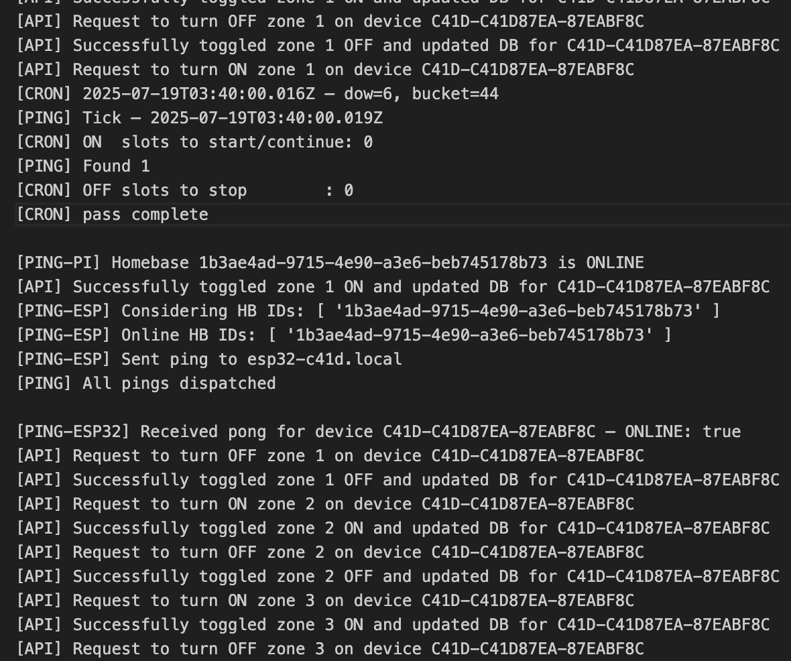

# Meltix Home Automation — Backend

The **Meltix Home Automation Backend** powers the connected infrastructure behind the Meltix ecosystem, a modular smart home platform built to manage local IoT devices through a secure and scalable architecture.

This repository contains the complete backend, WebSocket configurations, routes, Cron jobs, and database schema, as well as the code for the **Raspberry Pi bridge** and **ESP32 sprinkler controller**.

---
#### Link to Meltix Frontend Repository (Swift App): https://github.com/tomSadowy7/MeltixSwiftPublic

## Overview

The backend acts as the central hub for the Meltix Home Automation system. It connects the mobile app, Raspberry Pi, and ESP32 to enable reliable communication and automation.

### Key Features
- RESTful routes for authentication, device management, and scheduling  
- WebSocket configuration for persistent backend–Raspberry Pi communication  
- Cron jobs for scheduled device updates and maintenance tasks  
- Prisma-based database schema for structured and scalable data storage  
- Raspberry Pi client for backend communication and local device coordination  
- ESP32 firmware for sprinkler control *(garage door automation coming soon)*

---

## Communication Architecture

- The **backend** communicates with the **Raspberry Pi** via **WebSockets** for real-time control and updates.  
- The **Raspberry Pi** communicates with the **ESP32** using **REST** to send commands, receive acknowledgments, and maintain heartbeat checks.

+--------------------+
| iOS App (SwiftUI) |
+--------------------+
|
v
+-------------------+
| Backend Server |
+-------------------+
<-> WebSockets
|
v
+------------------+
| Raspberry Pi |
+------------------+
<-> REST API
|
v
+----------------------------+
| ESP32 Sprinkler Controller |
+----------------------------+

---

## Tech Stack

**Backend:** Node.js, Express, WebSockets, Cron  
**Database:** Prisma + PostgreSQL  
**Devices:**  
- Raspberry Pi (Python bridge)  
- ESP32 (Arduino C++ firmware for sprinkler control)

## Directory Structure

- **data/** — Data storage and logs  
- **esp32/** — ESP32 firmware for sprinkler control  
- **jobs/** — Cron jobs for scheduled automation  
- **prisma/** — Database schema and migrations  
- **raspberrypi/** — Raspberry Pi bridge (WebSocket + REST logic)  
- **routes/** — Express route handlers  
- **websockets/** — WebSocket connection management  
- **authMiddleware.js** — Route authentication middleware  
- **index.js** — Main backend entry point  
- **server.log** — Runtime logs  
- **package.json** — Project dependencies and scripts  

## Example Logs

